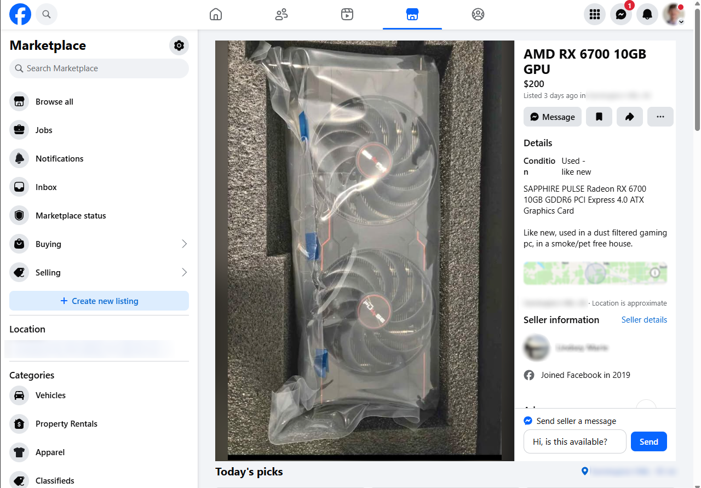
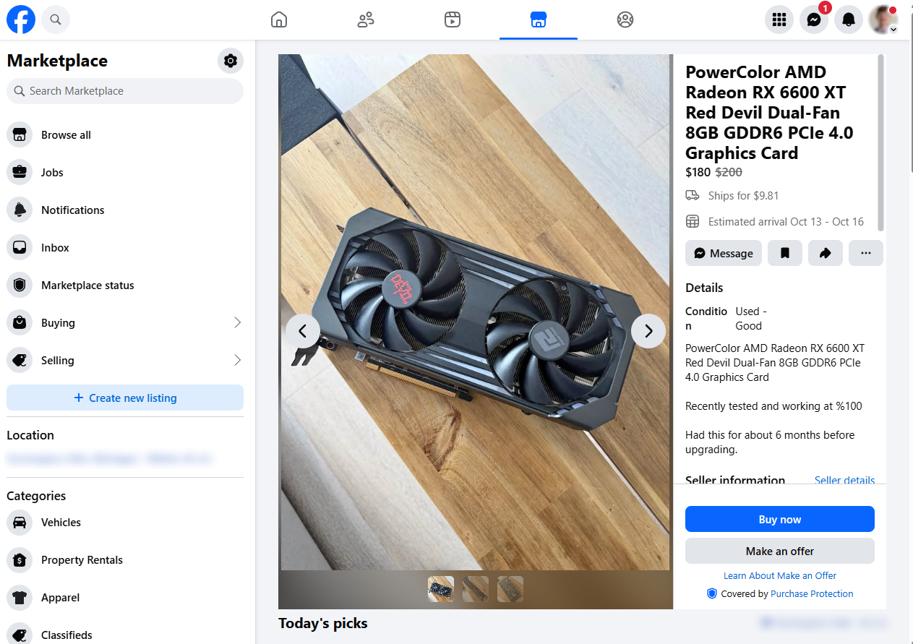

# OpenClaw — Facebook Marketplace Agent

Autonomous agent that interacts with Facebook Marketplace via natural language prompts. Tell it what to buy, it searches, evaluates, and messages sellers.

The AI can run two ways:
- **Local (default):** Mistral and Moondream through Ollama. Free, private, nothing leaves your machine.
- **Claude:** add `--claude` and every AI step goes through the Claude Code CLI on your existing login. No Ollama or local GPU needed, and you can pick a bigger model when judging listings needs more care.

```
you: "find 15 wireless keyboards under $50 in Portland, message sellers asking if available today"
agent: Searching... found 23 results → filtered to 15 → scored → messaged 12 sellers
```

Example listings the agent works through (a GPU search):

<p>
  
  
</p>

## Architecture

```
┌─────────────────────────────────────────────────┐
│                  CLI Prompt                      │
│         "find 10 PS5 controllers..."             │
└──────────────────┬──────────────────────────────┘
                   │
         ┌─────────▼──────────┐
         │   Prompt Parser    │  ← Mistral (Ollama)
         │  (NL → structured) │     or Claude
         └─────────┬──────────┘
                   │
         ┌─────────▼──────────┐
         │   Playwright       │  ← Real Chromium browser
         │  (login check,     │     with your FB session
         │   search, scroll,  │
         │   extract DOM +    │
         │   screenshot imgs) │
         └─────────┬──────────┘
                   │
         ┌─────────▼──────────┐
         │   Vision           │  ← Moondream (Ollama)
         │  (identify what's  │     or Claude
         │   in the photos)   │
         └─────────┬──────────┘
                   │
         ┌─────────▼──────────┐
         │   Scorer           │  ← Mistral (Ollama)
         │  (rank listings,   │     or Claude; uses text
         │   filter junk)     │     + image descriptions
         └─────────┬──────────┘
                   │
         ┌─────────▼──────────┐
         │   Messenger        │  ← Mistral or Claude
         │  (compose + send)  │     composes, Playwright
         └─────────┬──────────┘     sends
                   │
         ┌─────────▼──────────┐
         │   SQLite            │  ← Listings, messages,
         │  (persistence)      │     session history
         └────────────────────┘
```

All AI calls go through `src/llm.py`, which sends them to Ollama or to the `claude` CLI depending on the model name.

## Stack

| Layer | Tool |
|---|---|
| Text LLM | Ollama + Mistral (local), or Claude via the Claude Code CLI |
| Vision LLM | Ollama + Moondream (local), or Claude via the Claude Code CLI |
| Browser | Playwright (Chromium) |
| Orchestrator | Python |
| Storage | SQLite |

## Setup

1. **Pick an AI backend** (you can install both and switch per run):
   - **Ollama** — install from https://ollama.com, then:
     ```
     ollama pull mistral
     ollama pull moondream
     ```
   - **Claude** — install [Claude Code](https://claude.com/claude-code) and run `claude` once to log in. Calls are billed to that account (a fraction of a cent each on Haiku).

2. **Install dependencies** (requires [Poetry](https://python-poetry.org/docs/#installation)):
   ```
   poetry install
   poetry run playwright install chromium
   ```

3. **First run** — log into Facebook:
   ```
   poetry run python src/main.py login
   ```
   A browser opens. Log in manually, then close the browser. The session persists for future runs.

## Usage

**Login (one-time setup):**
```
poetry run python src/main.py login
```

**Check the login is still good:**
```
poetry run python tests/test_login.py
```
Prints "Logged in." or "NOT logged in". Every job runs the same check before searching and stops early if the session has expired.

**Interactive mode:**
```
poetry run python src/main.py
```

**One-shot:**
```
poetry run python src/main.py "find 10 PS5 controllers under $40, message sellers asking if available"
```

**Drive it with Claude:** add `--claude` (Haiku, fast and cheap) or `--claude=sonnet` / `--claude=opus` for stronger judgment. Works in both one-shot and interactive mode.
```
poetry run python src/main.py --claude "find 10 PS5 controllers under $40"
poetry run python src/main.py --claude=sonnet
```
To check the Claude connection on its own: `poetry run python src/llm.py`.

**Example prompts:**
```
"search for 15 wireless keyboards under $50 in Portland"
"find cheap mountain bikes under $200 within 10 miles, message sellers"
"look for iPhone 14 Pro cases, message the 5 cheapest sellers asking for bulk pricing"
```
